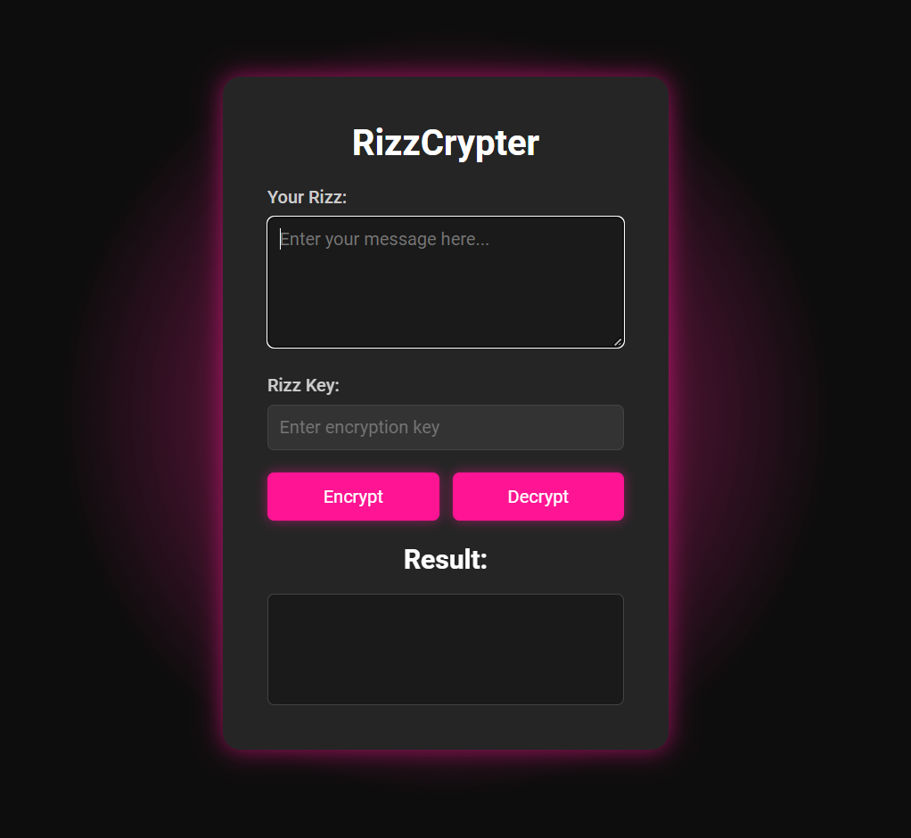

# RizzCrypter 🔐

**RizzCrypter** is a simple, web-based encryption tool built to showcase a key-based character shifting encryption technique. This project provides an interactive UI for encrypting and decrypting text using a user-defined key, making it ideal for learning and demonstrating encryption basics.

## 🚀 Live Demo

Check out the live version of **RizzCrypter**: [RizzCrypter Demo](https://mubbashirulislam.github.io/RizzCrypter/)




## ✨ Features

- **Key-Base Encryption & Decryption**: Encrypt and decrypt text using a user-supplied key.
- **Responsive UI**: Works seamlessly on desktops and mobile devices.
- **Real-Time Updates**: See results immediately after encryption or decryption.

## 🛠️ Tech Stack

- **Frontend**: HTML, CSS, JavaScript
- **Encryption Logic**: Custom key-based character shifting algorithm
- **Design**: Responsive UI with animations and smooth transitions

## 📂 Project Structure

```
RizzCrypter/
├── index.html          # HTML structure
├── style.css           # Styling with CSS, including animations
├── script.js           # JavaScript for encryption and decryption logic
```

### Key Files
- **index.html**: Provides the structure of the UI and elements for input/output.
- **style.css**: Handles the design, including the dark theme, animations, and responsive layout.
- **script.js**: Contains the core logic for text encryption and decryption based on the provided key.

## 🔐 Encryption Algorithm

RizzCrypter uses a custom-built character shifting encryption technique. The algorithm takes each character from the input message and shifts it based on the corresponding character from the key.

### Encryption Example:

For a message `"Hello"` with a key `"Key"`:

1. Take the first character of the message (`H`) and the first character of the key (`K`).
2. Find their indices in the alphabet and shift the message character by the key character's index.
3. Continue for each character in the message.

The process is reversed for decryption.

## 💻 Local Setup

If you want to run RizzCrypter locally, follow these steps:

1. Clone the repository:
   ```bash
   git clone https://github.com/mubbashirulislam/RizzCrypter.git
   ```

2. Navigate to the project directory:
   ```bash
   cd RizzCrypter
   ```

3. Open `index.html` in your browser to run the app locally.

## 🛣️ Roadmap

Future improvements may include:

- Adding more encryption algorithms (e.g., RSA, SHA-256).
- Extending the UI for file encryption.
- Improving key management and security features.

## 🤝 Contributing

Contributions, issues, and feature requests are welcome!  
Feel free to open an issue or submit a pull request. For major changes, please open a discussion first to ensure alignment with the project’s goals.

